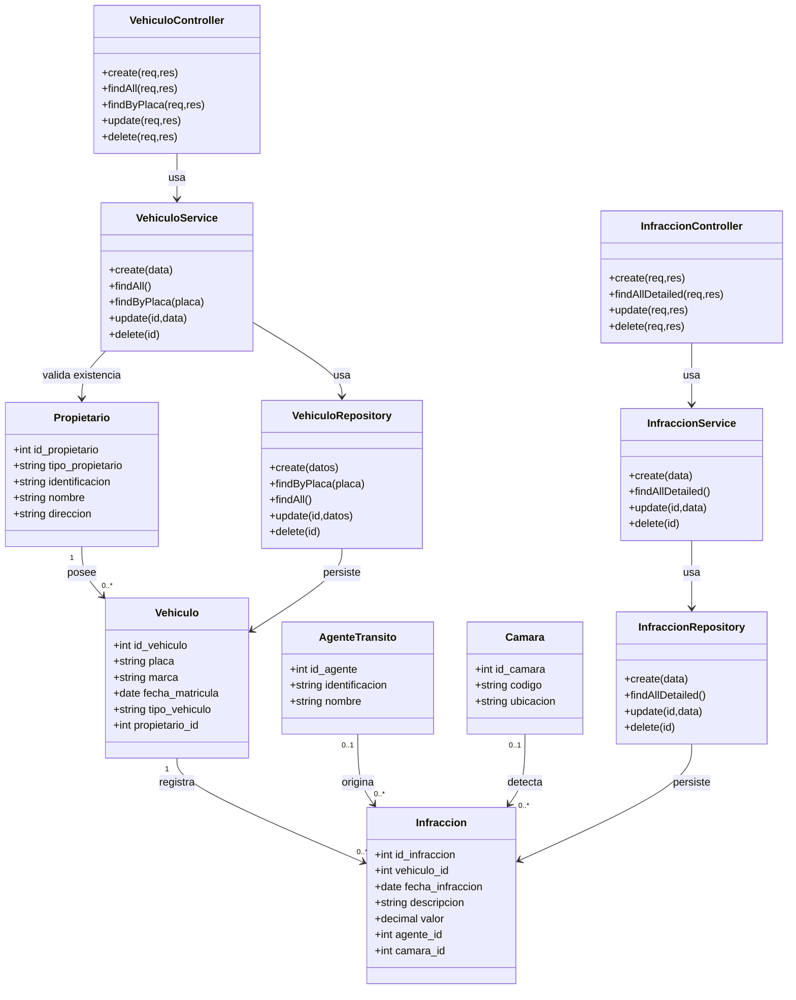

```mermaid
classDiagram

class Propietario {
  +int id_propietario
  +string tipo_propietario
  +string identificacion
  +string nombre
  +string direccion
}

class Vehiculo {
  +int id_vehiculo
  +string placa
  +string marca
  +date fecha_matricula
  +string tipo_vehiculo
  +int propietario_id
}

class AgenteTransito {
  +int id_agente
  +string identificacion
  +string nombre
}

class Camara {
  +int id_camara
  +string codigo
  +string ubicacion
}

class Infraccion {
  +int id_infraccion
  +int vehiculo_id
  +date fecha_infraccion
  +string descripcion
  +decimal valor
  +int agente_id
  +int camara_id
}

class VehiculoController {
  +create(req,res)
  +findAll(req,res)
  +findByPlaca(req,res)
  +update(req,res)
  +delete(req,res)
}

class VehiculoService {
  +create(data)
  +findAll()
  +findByPlaca(placa)
  +update(id,data)
  +delete(id)
}

class VehiculoRepository {
  +create(datos)
  +findByPlaca(placa)
  +findAll()
  +update(id,datos)
  +delete(id)
}

class InfraccionController {
  +create(req,res)
  +findAllDetailed(req,res)
  +update(req,res)
  +delete(req,res)
}

class InfraccionService {
  +create(data)
  +findAllDetailed()
  +update(id,data)
  +delete(id)
}

class InfraccionRepository {
  +create(data)
  +findAllDetailed()
  +update(id,data)
  +delete(id)
}

Propietario "1" --> "0..*" Vehiculo : posee
Vehiculo "1" --> "0..*" Infraccion : registra
AgenteTransito "0..1" --> "0..*" Infraccion : origina
Camara "0..1" --> "0..*" Infraccion : detecta

VehiculoController --> VehiculoService : usa
VehiculoService --> VehiculoRepository : usa
VehiculoService --> Propietario : valida existencia
VehiculoRepository --> Vehiculo : persiste

InfraccionController --> InfraccionService : usa
InfraccionService --> InfraccionRepository : usa
InfraccionRepository --> Infraccion : persiste
```